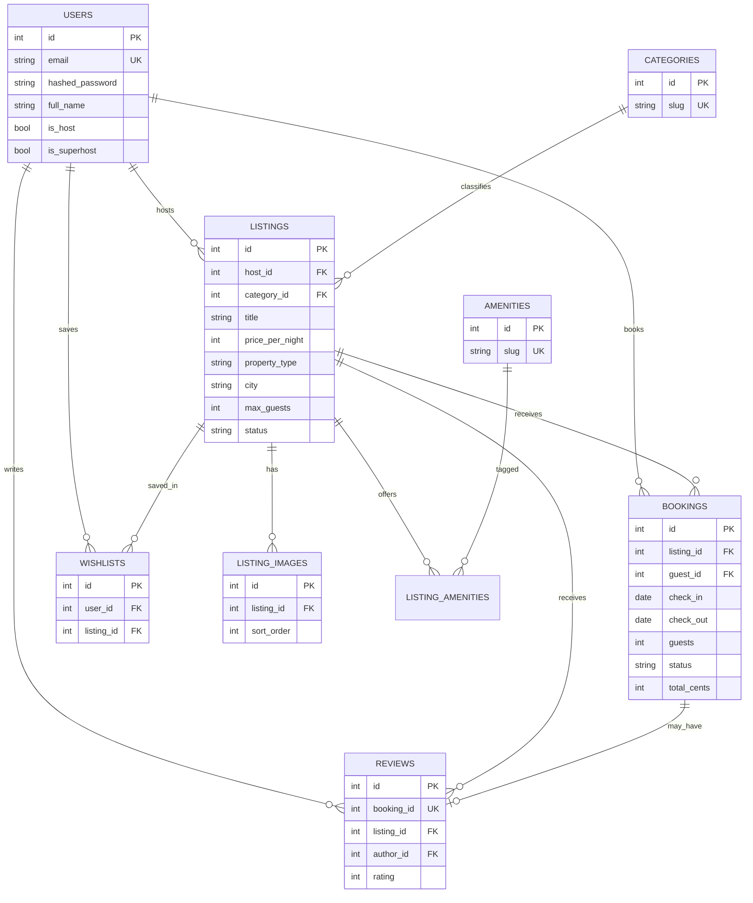

# Airbnb Clone — Architecture & Planning

> **Status:** Approved (2026-07-22)  
> **Source of truth for requirements:** Assignment PDF  
> **Source of truth for engineering plan:** This document  
> **Workflow:** Build one milestone at a time. Explain goal → files → why, then code. No multi-milestone codegen.

---

## Assignment alignment

| PDF requirement | Our plan |
|---|---|
| Home grid + search + filters + pagination | Milestones 3–4 |
| Listing detail (gallery, amenities, host, calendar, price, reviews) | Milestone 5 |
| Booking + overlap prevention + My Trips + mock checkout | Milestone 7 |
| Host CRUD + dashboard + bookings | Milestone 8 |
| Wishlist / toasts / Airbnb-like UX | Milestones 5–6, 9 |
| Seed data + README + deploy | Milestones 1 + 10 |
| Auth can be simplified | Real JWT (guest vs host) — stronger for interview |
| Reviews *section* = must; *leave review* = bonus | Display in M5; create-after-stay in M9 (bonus) |
| Map = static/basic OK | Static map image on detail; interactive map = bonus |
| Payments mocked | Mock checkout only |
| Repo shape: `frontend/` + `backend/` | Enforced |
| ~24h estimate | Quality-first; compress M9 bonuses first if deadline forces it |

**Approved defaults (2026-07-22):**

1. Repo layout: `frontend/` + `backend/` — OK  
2. Auth: real JWT — OK  
3. Search URL: filters on `/` via query string (Airbnb-like; more impressive than a separate `/search`)  
4. Listing images: URLs only for MVP; cloud upload = bonus — OK  
5. Soft-delete listings (`archived`) — OK  
6. Milestone order as listed — OK  

---

## 1. Project architecture

```
Airbnb-clone/
├── frontend/                 # Next.js App Router (Vercel)
│   ├── src/
│   │   ├── app/              # routes only (thin)
│   │   ├── components/       # UI by domain
│   │   ├── hooks/            # React Query + UI hooks
│   │   ├── services/         # Axios API clients
│   │   ├── types/            # shared TS interfaces
│   │   ├── utils/            # pure helpers
│   │   ├── constants/        # routes, query keys, config
│   │   ├── providers/        # QueryClient, Auth, Theme
│   │   └── lib/              # axios instance, cn(), form helpers
│   ├── public/
│   └── package.json
│
├── backend/                  # FastAPI (Render)
│   ├── app/
│   │   ├── main.py
│   │   ├── api/              # routers (HTTP only)
│   │   ├── core/             # security, config, exceptions
│   │   ├── db/               # engine, session, base
│   │   ├── models/           # SQLAlchemy
│   │   ├── schemas/          # Pydantic I/O
│   │   ├── repositories/     # DB access only
│   │   ├── services/         # business rules
│   │   ├── middleware/
│   │   └── utils/
│   ├── alembic/
│   ├── scripts/seed.py
│   ├── tests/
│   └── requirements.txt
│
├── docs/
│   └── ARCHITECTURE_AND_PLAN.md   # this file
└── README.md
```

### Why this shape

- PDF requires `frontend/` + `backend/` — interviewers open the repo and immediately see professionalism.
- Backend layers: **Router → Service → Repository → DB**. Routers never talk to ORM; repositories never contain booking overlap logic.
- Frontend: **Route → Component → Hook → Service**. Pages stay thin; data fetching lives in hooks.

**Interview answer:** “Separation of concerns so each layer is testable and replaceable — e.g. swap SQLite for Postgres without touching routers.”

---

## 2. Frontend architecture

### Layering

| Layer | Responsibility | Does NOT |
|---|---|---|
| `app/` routes | Layout, composition, SEO metadata | Fetch business logic, forms |
| `components/` | Presentational + composed UI | Call Axios directly |
| `hooks/` | TanStack Query, URL sync, form orchestration | Render markup-heavy UI |
| `services/` | Typed Axios calls | Know about React state |
| `types/` | Shared interfaces matching API | Runtime logic |
| `providers/` | Auth session, QueryClient, theme | Feature UI |

### Key patterns

- **Server Components** for static shells (footer, some layouts).
- **Client Components** for search, calendar, booking, host forms.
- **React Hook Form + Zod** for all forms (search, auth, listing CRUD, booking).
- **URL as source of truth** for search/filters on `/` (shareable, back-button friendly, Airbnb-like).
- **shadcn/ui** as primitive kit; Airbnb look via custom tokens (Airbnb coral `#FF385C`, circular nav, card typography) — not default shadcn purple.
- **Framer Motion** sparingly: gallery transitions, modal enter/exit, filter drawer, card hover — not decorative noise.

### Auth on frontend

- Access token in memory (or httpOnly cookie if we implement cookie auth later).
- Refresh optional for MVP; short-lived JWT + re-login is acceptable for interview scope.
- `AuthProvider` exposes `{ user, isHost, login, logout, register }`.
- Route guards via layout wrappers: `(public)`, `(auth)`, `(host)`.

### Tech stack (locked)

- Next.js (TypeScript, App Router)
- TailwindCSS + shadcn/ui
- React Hook Form + Zod
- TanStack Query + Axios
- Framer Motion
- React Hot Toast
- Lucide Icons

---

## 3. Backend architecture

```
Request
  → CORS / exception middleware
  → Router (validate path/query/body via Pydantic)
  → Depends(get_current_user) when protected
  → Service (rules: overlap, ownership, fees)
  → Repository (SQLAlchemy queries)
  → SQLite
Response envelope (consistent shape)
```

### Dependency injection

```text
get_db() → Session
get_listing_repo(db) → ListingRepository
get_listing_service(repo, booking_repo) → ListingService
router Depends(get_listing_service)
```

### Cross-cutting

- **Central exception handlers** → `{ "detail", "code", "errors?" }` + correct HTTP status.
- **Pagination:** `page`, `page_size` → `{ items, total, page, page_size, pages }`.
- **Auth:** JWT Bearer; roles via `is_host` flag (a user can be both guest and host).
- **Transactions:** booking create must check availability + insert in **one transaction** (SQLite + `BEGIN IMMEDIATE` for race safety).

### Mentor note

Repository pattern on SQLite for a short assignment is slightly heavy — but for a **hiring interview** it’s the right call. Interviewers ask “where does business logic live?” and you point at `services/`. Do **not** skip it.

### Tech stack (locked)

- Python + FastAPI
- SQLAlchemy ORM + Alembic
- Pydantic
- SQLite
- JWT Authentication
- CORS
- Repository pattern

---

## 4. Database schema

### Design decisions

1. **No separate `hosts` table** — `users.is_host` + `listings.host_id`. A Host *is* a User. Avoids 1:1 table bloat.
2. **Amenities as M2M** — normalized, filterable, seedable.
3. **Categories as lookup table** — Airbnb-style pills (Beachfront, Cabins…), not free text.
4. **Listing images as child rows** with `sort_order` — gallery order is data, not array-in-JSON.
5. **Bookings store price snapshot** — nightly rate / fees at booking time so later price edits don’t rewrite history.
6. **Overlap prevention** — application + DB CHECK constraints; SQLite has no exclusion constraints, so service-layer query inside a transaction is the real guard.
7. **Wishlist** — simple M2M unique `(user_id, listing_id)`.
8. **Reviews** — one review per booking (`booking_id` UNIQUE); only after completed stay (checkout date passed, status `completed`).
9. **Soft-delete listings** — set `status = archived` instead of hard DELETE (preserves booking history).

### Tables

#### users

| Column | Type | Notes |
|---|---|---|
| id | INTEGER PK | |
| email | TEXT UNIQUE NOT NULL | |
| hashed_password | TEXT NOT NULL | |
| full_name | TEXT NOT NULL | |
| avatar_url | TEXT NULL | |
| is_host | BOOLEAN DEFAULT 0 | |
| is_superhost | BOOLEAN DEFAULT 0 | bonus display |
| created_at / updated_at | DATETIME | |

#### categories

| id, name, slug UNIQUE, icon_key, sort_order |

#### amenities

| id, name, slug UNIQUE, icon_key, group (e.g. bathroom, outdoor) |

#### listings

| Column | Type | Notes |
|---|---|---|
| id | INTEGER PK | |
| host_id | FK users ON DELETE CASCADE | |
| category_id | FK categories | |
| title, description | TEXT | |
| property_type | TEXT | house, apartment, guesthouse, hotel… |
| price_per_night | INTEGER (cents) | avoid float money |
| cleaning_fee | INTEGER (cents) | |
| service_fee_percent | INTEGER | or fixed fee in cents |
| currency | TEXT DEFAULT 'USD' | |
| country, city, state, address | TEXT | |
| lat, lng | REAL NULL | for static map / bonus pins |
| max_guests, bedrooms, beds, bathrooms | INTEGER | |
| status | TEXT | draft / active / archived |
| created_at / updated_at | | |

Indexes: `(city)`, `(price_per_night)`, `(category_id)`, `(host_id)`, `(status)`, `(lat, lng)` optional.

#### listing_images

| id, listing_id FK CASCADE, url, alt_text, sort_order |

#### listing_amenities

| listing_id, amenity_id | PK composite |

#### bookings

| Column | Type | Notes |
|---|---|---|
| id | PK | |
| listing_id | FK | |
| guest_id | FK users | |
| check_in, check_out | DATE | check_out > check_in (CHECK) |
| guests | INTEGER | ≤ listing.max_guests |
| status | TEXT | pending / confirmed / cancelled / completed |
| nightly_rate_cents | INTEGER | snapshot |
| cleaning_fee_cents | INTEGER | snapshot |
| service_fee_cents | INTEGER | snapshot |
| total_cents | INTEGER | snapshot |
| created_at | | |

Indexes: `(listing_id, check_in, check_out)`, `(guest_id)`, `(status)`.

**Overlap rule (service):** for same listing, any booking with `status IN ('pending','confirmed')` where  
`existing.check_in < new.check_out AND existing.check_out > new.check_in` → reject **409**.

#### reviews

| id, booking_id UNIQUE FK, listing_id FK, author_id FK, rating 1–5, comment, created_at |

#### wishlists

| id, user_id, listing_id, UNIQUE(user_id, listing_id), created_at |

### ER diagram



---

## 5. REST API design

Base: `/api/v1`  
Auth: `Authorization: Bearer <jwt>`  
Envelope list: `{ items, total, page, page_size, pages }`  
Errors: `{ detail, code, errors? }`

### Auth

| Method | Path | Auth | Body | Success | Notes |
|---|---|---|---|---|---|
| POST | `/auth/register` | — | email, password, full_name, is_host? | 201 User | 409 email taken |
| POST | `/auth/login` | — | email, password | 200 `{ access_token, token_type, user }` | 401 invalid |
| GET | `/auth/me` | JWT | — | 200 User | 401 |

### Categories & amenities (public)

| Method | Path | Success |
|---|---|---|
| GET | `/categories` | 200 list |
| GET | `/amenities` | 200 list |

### Listings (public read)

| Method | Path | Auth | Query / Body | Status |
|---|---|---|---|---|
| GET | `/listings` | — | location, check_in, check_out, guests, min_price, max_price, amenities[], category, property_type, sort, page, page_size | 200 paginated |
| GET | `/listings/{id}` | — | — | 200 / 404 |
| GET | `/listings/{id}/availability` | — | from, to | 200 blocked date ranges |
| GET | `/listings/{id}/reviews` | — | page… | 200 |

**Search validation:** if one of check_in/check_out present, both required; check_out > check_in; guests ≥ 1; prices ≥ 0.

**Sort:** `price_asc` | `price_desc` | `rating_desc` | `newest`

### Listings (host)

| Method | Path | Auth | Status |
|---|---|---|---|
| POST | `/host/listings` | host | 201 |
| PATCH | `/host/listings/{id}` | owner | 200 / 403 / 404 |
| DELETE | `/host/listings/{id}` | owner | 204 (soft → archived) |
| GET | `/host/listings` | host | 200 owned |
| GET | `/host/listings/{id}/bookings` | owner | 200 |
| GET | `/host/dashboard` | host | 200 summary stats |

### Bookings

| Method | Path | Auth | Status |
|---|---|---|---|
| POST | `/bookings` | JWT | 201 / 409 overlap / 400 invalid dates/guests |
| POST | `/bookings/{id}/checkout` | guest owner | 200 confirmed (mock pay) |
| GET | `/bookings/me` | JWT | 200 My Trips (upcoming / past / cancelled) |
| GET | `/bookings/{id}` | guest or host | 200 |
| POST | `/bookings/{id}/cancel` | guest | 200 |

### Wishlist

| Method | Path | Auth | Status |
|---|---|---|---|
| POST | `/wishlists/{listing_id}` | JWT | 201 / 200 idempotent |
| DELETE | `/wishlists/{listing_id}` | JWT | 204 |
| GET | `/wishlists` | JWT | 200 |

### Reviews (bonus write; read is core)

| Method | Path | Auth | Body | Status |
|---|---|---|---|---|
| POST | `/reviews` | JWT | booking_id, rating, comment | 201 / 400 not completed / 409 already reviewed |
| GET | `/listings/{id}/reviews` | — | — | (see listings) |

### Validation principles

- Pydantic schemas for every I/O model.
- Path IDs as positive ints.
- Money always integers (cents).
- Never trust client-computed totals — **server recalculates**.

---

## 6. State management

| Concern | Where | Why |
|---|---|---|
| Listings search results, detail, bookings, wishlist, host data | **TanStack Query** | Cache, staleTime, refetch, optimistic wishlist toggle |
| Search filters + pagination | **URL search params on `/`** | Shareable, SSR-friendly, back/forward works, Airbnb-like |
| Auth user session | **React Context** (`AuthProvider`) | Cross-tree, infrequent updates |
| Modal open, gallery index, date-picker hover, drawer | **Local useState** | Ephemeral UI |
| Booking wizard draft (dates/guests before submit) | **Local + URL on detail** where useful | Don’t put half-forms in Query |
| Theme (dark mode bonus) | Context or `next-themes` | |

**Do not** put server lists in Context.  
**Do not** put auth tokens only in localStorage without XSS discussion in interview — mention httpOnly cookies as the production upgrade.

**Optimistic updates:** wishlist heart only (low risk). Bookings stay pessimistic (confirm after API) — money-adjacent.

---

## 7. Routing plan

### Decision: search on `/` with query params

**Chosen over a dedicated `/search` route** because:

- Matches real Airbnb (explore home + query string).
- One composition for the first viewport (brand/search/grid) instead of a split “marketing home” vs “results” app.
- Shareable URLs (`/?location=Bali&guests=2&min_price=…`) look production-ready in demos.

Optional later: keep `/search` as an alias that redirects to `/?…` if needed — not required for MVP.

### Guest / public

| Route | Purpose |
|---|---|
| `/` | Home explore grid + category row + search (filters via query params) |
| `/listings/[id]` | Detail |
| `/login`, `/register` | Auth |
| `/wishlists` | Favorites (protected) |
| `/trips` | My Trips (protected) |
| `/trips/[bookingId]/confirm` | Confirmation after mock pay |
| `/bookings/[id]/checkout` | Mock payment |

### Host (protected + `is_host`)

| Route | Purpose |
|---|---|
| `/host` | Dashboard |
| `/host/listings` | Owned listings |
| `/host/listings/new` | Create |
| `/host/listings/[id]/edit` | Edit |
| `/host/bookings` | Incoming bookings |

### Protection

- Unauthenticated → redirect `/login?next=…`
- Host routes → 403 page or “Become a host” if `!is_host`
- Layout groups: `(public)`, `(auth)`, `(host)`

---

## 8. Reusable components

| Component | Responsibility |
|---|---|
| `Navbar` | Logo, search (compact), become host, user menu |
| `SearchBar` / `SearchModal` | Location, dates, guests — Airbnb pill style |
| `CategoryRow` | Horizontal scroll categories |
| `FilterDrawer` / `FilterBar` | Price, type, amenities |
| `ListingCard` | Photo, wish heart, title, location, price, rating |
| `ListingGrid` | Responsive grid + empty state |
| `ListingGallery` | Main + grid / lightbox |
| `AmenityList` | Icons + labels |
| `HostCard` | Avatar, name, superhost badge |
| `AvailabilityCalendar` / `DateRangePicker` | Blocked ranges, selection |
| `PriceBreakdown` | Nights × rate + cleaning + service |
| `BookingWidget` | Sticky sidebar on detail |
| `BookingCard` | My Trips / host bookings |
| `ReviewCard` + `ReviewList` | Rating + text |
| `Modal` / `Drawer` | Shared primitives |
| `Skeleton` variants | Card, detail, trips |
| `EmptyState` | Illustration + CTA |
| `Toast` | via react-hot-toast wrapper |
| `MapPlaceholder` | Static image from lat/lng |
| Host: `ListingForm`, `ImageUrlFields`, `DashboardStats` | CRUD |

**Composition rule:** `ListingCard` does not fetch; parent/hook supplies data. Gallery does not know about bookings.

---

## 9. Development roadmap

Each milestone ends with something you can run and demo. **Never implement multiple milestones in one pass.**

### Milestone 0 — Monorepo skeleton & contracts

**Goal:** Both apps boot; CORS works; health check; shared API contract documented.  
**Deliverable:** `GET /health` → 200; Next.js page calling it.  
**Why first:** Unblocks parallel FE/BE without thrash.

### Milestone 1 — Database + Alembic + seed

**Goal:** Full schema migrated; seed hosts, guests, listings, images, amenities, sample bookings.  
**Demo:** Open SQLite and see rich data.  
**Why:** App is useless without seed (PDF requirement).

### Milestone 2 — Auth API + Auth UI

**Goal:** Register/login/me; JWT; guest vs host.  
**Demo:** Login, see user in navbar.  
**Interview:** password hashing (bcrypt), JWT claims, protected deps.

### Milestone 3 — Listings API (read) + Airbnb home shell

**Goal:** Paginated listings API; home grid with real seed cards; Navbar; skeleton loading.  
**Demo:** Looks like Airbnb explore with photos/prices.  
**UI focus starts here** — visual resemblance is an evaluation criterion.

### Milestone 4 — Search, filters, URL sync, sort

**Goal:** Location, guests, price, amenities, category, property type, availability-aware search, pagination — all synced to `/` query params.  
**Demo:** Change filters → URL updates → refresh keeps state.  
**Why:** Core PDF “Home & Search.”

### Milestone 5 — Listing detail + gallery + reviews display + static map

**Goal:** Full detail page; price breakdown (live with dates); amenities; host info; reviews list.  
**Demo:** Click card → Airbnb-like detail.  
**Note:** Review *creation* still later (bonus).

### Milestone 6 — Wishlist

**Goal:** Toggle favorite; wishlists page; optimistic UI + toast.  
**Demo:** Heart persists across refresh.

### Milestone 7 — Booking flow

**Goal:** Availability check, overlap prevention, guest validation, summary, mock checkout, confirmation, My Trips; dates blocked afterward.  
**Demo:** Book → second user cannot take overlapping dates.  
**This is the critical path for “Functionality” scoring.**

### Milestone 8 — Host panel CRUD

**Goal:** Dashboard, create/edit/delete (archive), view bookings, basic availability awareness.  
**Demo:** Create listing → appears on home.  
**PDF must-have.**

### Milestone 9 — Polish + bonuses

**Goal:** Motion, empty/error states, responsive pass, dark mode (bonus), post-stay review create (bonus), optional map pins.  
**Demo:** Feels production-ready on phone + desktop.

### Milestone 10 — README, deploy, architecture review

**Goal:** Public GitHub, Vercel + Render, README (setup, architecture, schema, API, assumptions), final refactor pass.  
**PDF deliverables.**

---

## Engineering decisions to defend in interview

| Decision | Chosen | Alternative | Trade-off |
|---|---|---|---|
| Money | Integer cents | Decimal/float | Floats break money; cents are interview-safe |
| Host model | `is_host` on User | Separate Host table | Simpler; host profile can grow later |
| Search state | URL params on `/` | Dedicated `/search` or Zustand only | Shareability + Airbnb UX > convenience |
| Booking races | Transaction + re-check | DB exclusion (Postgres) | SQLite limit; document upgrade path |
| Soft delete listings | `archived` | Hard DELETE | Preserves booking history |
| Image upload | URL fields first | S3 (bonus) | PDF allows URL/upload; URLs ship faster |
| Auth | JWT Bearer | Fully mocked | Slightly more work; much better interview story |
| Pagination | Page-based first | Infinite scroll only | Clearer API; infinite scroll can wrap later |

---

## Mentor challenges (standing rules)

1. **Dark mode** — bonus only; do not spend early milestone time on it. Airbnb resemblance > theme toggle.
2. **Infinite scroll vs pagination** — prefer pagination first; infinite scroll can wrap the same endpoint later.
3. **File comments** — 1–3 line module docstring explaining *why* the file exists; avoid chatty noise on every function.
4. **Framer Motion** — 2–3 intentional motions max per major surface; not decorative noise.
5. **Deadline compression** — cut M9 bonuses first; never sacrifice M7 booking integrity.
6. **After every milestone** — architecture review for duplication, bad abstractions, typing gaps, React/backend anti-patterns, security, folder structure; refactor if needed.
7. **If PDF requirement is missed** — STOP and point it out before generating code.

---

## Interview mode (standing rule)

Whenever we implement something, also explain:

- why this approach was chosen
- alternatives
- trade-offs
- interview questions they may ask
- how to answer them

**Living study guide:** [`docs/INTERVIEW_NOTES.md`](./INTERVIEW_NOTES.md) — append new bits after every milestone.

---

## Quality gate (ask before every change)

- Is this production-quality?
- Can this be simplified?
- Can this be made more modular?
- Would a senior engineer approve this?

---

## Milestone progress

| Milestone | Status |
|---|---|
| 0 — Monorepo skeleton & contracts | **Complete** (2026-07-22) |
| 1 — Database + Alembic + seed | **Complete** (2026-07-22) |
| 2 — Auth API + Auth UI | **Complete** (2026-07-22) |
| 3 — Listings API + home shell | **Complete** (2026-07-22) |
| 4 — Search, filters, URL sync | **Complete** (2026-07-22) |
| 5 — Listing detail | **Complete** (2026-07-22) |
| 6 — Wishlist | **Complete** (2026-07-22) |
| 7 — Booking flow | **Complete** (2026-07-22) |
| 8 — Host CRUD | **Complete** (2026-07-23) |
| 9 — Polish + bonuses | **Complete** (2026-07-23) |
| 10 — README / deploy | Next |

API contract for live endpoints: [`docs/API_CONTRACT.md`](./API_CONTRACT.md)

## Next step

**Milestone 10** — README completeness, public GitHub, Vercel + Render deploy.

When ready: explain goal → files → why → then generate code for Milestone 10 only.
